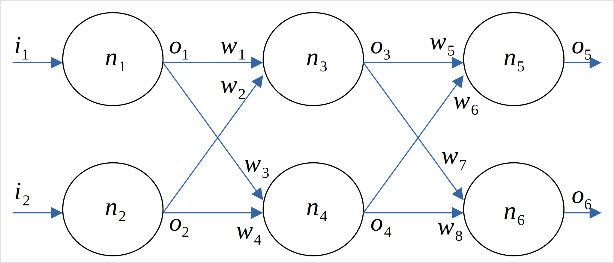

# NeuralNetwork

This is a C++ implementation of a basic, general-purpose feedworward neural network with a freely configurable number of layers and freely configurable number of neurons in each layer.

There are many ready-and-easy-to-use NN frameworks for C++ and especially Python which -to some degree- allow you to avoid making your feet wet with the nuts&bolts of the underlying principles. But I wanted to learn the fundamentals and create my own, working NN from scratch, without any external dependencies.

The main program's purpose is to train a NN to detect handwritten digits as provided by the [MNIST dataset](https://pjreddie.com/projects/mnist-in-csv/). Since the MNIST dataset contains 28x28 pixel large annotated pictures of handwritten digits, the input layer of the program's neural network has 28x28=784 neurons. And since there are 10 different digits to be detected, the output layer has 10 neurons. Each neuron's output indicates the (non-)detection of a specific digit - the neuron with the highest output value "wins the vote", so to speak.

In the hidden layer, there are 100 neurons. This number has been chosen by trial and error. Altogether, the network achieves a detection rate of about 95%.

I gained the knowledge about neural networks mainly from D. Kriesel's [A Brief Introduction to Neural Networks](https://dkriesel.com/en/science/neural_networks).

## Cloning and Compilation

Clone with:

    git clone https://github.com/chn-dev/NeuralNetwork

and then compile with:

    cd NeuralNetwork
    cmake . -B build
    cd build
    make

## Usage

Assuming you have downloaded the MNIST training and test datasets (mnist_train.csv and mnist_test.csv respectively), you invoke the main program like this:

    ./NeuralNetwork /path/to/mnist_train.csv /path/to/mnist_test.csv

The program will give a progress feedback during training and testing. After testing, it gives a success rate.

## Some Fundamentals in a Nutshell

In feedforward neural networks, the neurons are arranged in layers, whereby neurons of a given layer are connected to all neurons of the previous layer. There is an input layer (where all neurons have only one input), an arbitrary number of hidden layers and an output layer. Signals are fed from the input layer through the hidden layers to the output layer.

The input layer is a special case because it just passes the input signals unaltered through to the first hidden layer.

A neuron consists of:

* a specific number of inputs: $i_1 .. i_n$
* a weight for each of its inputs: $w_1 .. w_n$
* an activation function: $f_{act}()$
* an output: $o$

In order to calculate the output of a neuron, the activation function is applied to the weighted sum of the inputs

$$o = f_{act}( \sum_{k = 1}^{n}{i_k w_k} )$$

The logistic function is a widely used activation function:

$$f_{act}(x) = { 1 \over { 1 + e ^ { -x } } }$$

Therefore, we calculate the neuron's output with:

$$
o =
{
   1 \over
   {
      1 + e ^
         {
            -\sum_{k=1}^{n}{i_k w_k}
         }
   }
}
$$

### Querying a Neural Network

In order to query the neural network as a whole, we feed the components of the input vector into the neurons of the input layer and then successively feed the outputs of each layer successively into the inputs of the next layer by applying the formula above.

Let's consider a simple 2x3 neural network with an input layer, one hidden layer and an output layer, each with 2 neurons:

The input vector is

$$
I = \begin{bmatrix}
           i_1 \\
           i_2
         \end{bmatrix}
$$

We feed the two components $i_1$ and $i_2$ of the input vector $I$ into the network and want to obtain the response $o_5$ and $o_6$ of the network.

  1. Since neurons $n_1$ and $n_2$ are part of the input layer, they pass their inputs unaltered through to their outputs. This means that $o_1 = i_1$ and $o_2 = i_2$.

  2. The outputs $o_3$ and $o_4$ of neurons $n_3$ and $n_4$ are calculated with:
     $$o_3 = { 1 \over { 1 + e ^ { -( w_1 o_1 + w_2 o_2 ) } } }$$
     $$o_4 = { 1 \over { 1 + e ^ { -( w_3 o_1 + w_4 o_2 ) } } }$$

  3. The outputs $o_5$ and $o_6$ of neurons $n_5$ and $n_6$ are calculated with:
     $$o_5 = { 1 \over { 1 + e ^ { -( w_5 o_3 + w_6 o_4 ) } } }$$
     $$o_6 = { 1 \over { 1 + e ^ { -( w_7 o_3 + w_8 o_4 ) } } }$$

     After replacing $o_3$ and $o_4$, we obtain:

     $$o_5 = { 1 \over { 1 + e ^ { -( w_5 { 1 \over { 1 + e ^ { -( w_1 i_1 + w_2 i_2 ) } } } + w_6 { 1 \over { 1 + e ^ { -( w_3 i_1 + w_4 i_2 ) } } } ) } } }$$

     $$o_6 = { 1 \over { 1 + e ^ { -( w_7 { 1 \over { 1 + e ^ { -( w_1 i_1 + w_2 i_2 ) } } } + w_8 { 1 \over { 1 + e ^ { -( w_3 i_1 + w_4 i_2 ) } } } ) } } }$$

This is still a small neural network. You can see that as neural networks become bigger, the necessary calculations rapidly become more and more complex and nested. Luckily, computers can do this very quickly for us, even with millions of neurons in hundreds of layers.

### Training a Neural Network

Training data is a set of input vectors of the form

$$ X = \begin{bmatrix}
           x_1 \\
           x_2 \\
           \vdots \\
           x_n
         \end{bmatrix} $$

and a set of expected network responses of the form

$$ T = \begin{bmatrix}
           t_1 \\
           t_2 \\
           \vdots \\
           t_n
         \end{bmatrix} $$

This is often called "annotation" in training datasets. For example, the MNIST dataset contains 28x28 pixel vectors representing handwritten digits plus an appropriate annotation indicating what the digit actually is, for example: "3". This is needed to evaluate the error of the network. The NeuralNetwork program translates this annotation to the expected output vector

$$ T = \begin{bmatrix}
           0 \\
           0 \\
           0 \\
           1 \\
           0 \\
           0 \\
           0 \\
           0 \\
           0 \\
           0
         \end{bmatrix} $$

so we expect neuron 3 to detect digit 3 by outputting 1, all others are expected to output 0.

The neural network responds to the input vector $X$ with the output vector

$$ O = \begin{bmatrix}
           o_1 \\
           o_2 \\
           \vdots \\
           o_n
       \end{bmatrix} $$

A perfect neural network would always respond with $O = T$. That never happens, though. Or if it happens, your network has probably just learned by rote (overfitting).

There will always be an error which can be calculated with

$$ E = \begin{bmatrix}
          { 1 \over 2 }( t_1 - o_1 ) ^ 2 \\
          { 1 \over 2 }( t_2 - o_2 ) ^ 2 \\
          \vdots \\
          { 1 \over 2 }( t_n - o_n ) ^ 2
       \end{bmatrix} $$

Each component of the error vector is actually the mean squared error (MSE), whereby $\delta = t - o$ is the error, expressed as the difference between the network's output $o$ and the expected output $t$.

For a given training input vector, the error only depends on the input weights. What we do is to successively feed training vectors into the network, calculate the output error vector and reduce that error a little bit by adjusting the input weights of every neuron.

So lets consider a single neuron:

We can calculate the output error with:

$$
err(w_1, .., w_n) = { 1 \over 2 } \delta ^ 2 = { 1 \over 2 } ( t - o ) ^ 2
= { 1 \over 2 } ( t - { 1 \over { 1 + e ^ { -\sum_{k = 1}^{n}{i_k w_k} ) } } } ) ^ 2
$$

This is the multidimensional error function, with the input weights $w_1, .., w_n$ being the variables. We we try to successively reduce the error by adjusting the input weights. This can be done with a technique called gradient descent.

#### Gradient Descent

The gradient of the error function indicates its slope at a specific point $w_1,..,w_n$. A positive gradient $g$ means that the error increases with an increasing weight $w_m$. A negative gradient $g$ means that the error decreases with an increasing weight $w_m$. The absolute value of the gradient $g$ indicates to what degree the error changes. In order to reduce the error, we adjust a weight $w_m$ in proportion to the negative gradient $g$:

$$ \Delta w_m = - \alpha g $$

We call $\alpha$ the learning rate, determining to what degree a single training vector contributes to the adjustment of the weights. It can be anything between 0 and 1. In the NeuralNetwork program, we use $\alpha = 0.2$.

The gradient $g$ is the first partial derivative of the error function with respect to an input weight $w_m$:

$$
g = { d \over dw_m } err(w_1, .., w_n)
= { d \over dw_m } { 1 \over 2 } ( t - { 1 \over { 1 + e ^ { -\sum_{k = 1}^{n}{i_k w_k} ) } } } ) ^ 2
$$

Note that the activation function $f_{act}(x)$ is part of the error function, so we need the derivative of $f_{act}(x)$:

$$
{ d \over dx } f_{act}(x) = { d \over dx } { 1 \over { 1 + e^{-x} } }
= { d \over dx } ( 1 + e^{-x} ) ^ {-1}
$$

$$
= -( 1 + e^{-x} ) ^ {-2} { d \over dx } ( 1 + e ^ {-x} )
$$

$$
= - { 1 \over ( 1 + e^{-x} ) ^ 2 } e^{-x} { d \over dx } (-x)
= - { 1 \over ( 1 + e^{-x} ) ^ 2 } (-e^{-x})
= { e ^ {-x} \over ( 1 + e^{-x} ) ^ 2 }
$$

$$
= { { 1 + e^{-x} - 1 } \over { ( 1 + e^{-x} ) ^ 2 } }
= { { 1 + e^{-x} } \over { ( 1 + e^{-x} ) ^ 2 } } - { 1 \over { ( 1 + e^{-x} ) ^ 2 } }
$$

$$
= { 1 \over { 1 + e^{-x} } } - { 1 \over { ( 1 + e^{-x} ) ^ 2 } }
= { 1 \over { 1 + e^{-x} } } ( 1 - { 1 \over { 1 + e^{-x} } } )
$$

$$
= f_{act}(x) ( 1 - f_{act}(x) )
$$

Having done this, we can continue with the derivative of the error function:

$$
g = { d \over dw_m } err(w_1, .., w_n)
= { d \over dw_m } { 1 \over 2 } ( t - { 1 \over { 1 + e ^ { -\sum_{k = 1}^{n}{i_k w_k} ) } } } ) ^ 2
$$

$$
= { d \over dw_m } { 1 \over 2 } ( t - f_{act}(\sum_{k = 1}^{n}{i_k w_k}) ) ^ 2
$$

$$
= ( t - f_{act}(\sum_{k = 1}^{n}{i_k w_k} ) ) { d \over dw_m } ( t - f_{act}(\sum_{k = 1}^{n}{i_k w_k} ) )
$$

$$
= - ( t - f_{act}(\sum_{k = 1}^{n}{i_k w_k} ) ) { d \over dw_m } f_{act}(\sum_{k = 1}^{n}{i_k w_k} )
$$

$$
= - ( t - f_{act}(\sum_{k = 1}^{n}{i_k w_k} ) ) f_{act}(\sum_{k = 1}^{n}{i_k w_k} ) ( 1 - f_{act}(\sum_{k = 1}^{n}{i_k w_k} ) ) { d \over dw_m } \sum_{k = 1}^{n}{i_k w_k}
$$

$$
= - ( t - f_{act}(\sum_{k = 1}^{n}{i_k w_k} ) ) f_{act}(\sum_{k = 1}^{n}{i_k w_k} ) ( 1 - f_{act}(\sum_{k = 1}^{n}{i_k w_k} ) ) i_m
$$

With

$$f_{act}(\sum_{k = 1}^{n}{i_k w_k} ) = o$$

and

$$\delta = t - o$$

we obtain:

$$
g = { d \over dw_m } err(w_1, .., w_n)
= - ( t - o ) o ( 1 - o ) i_m
= - \delta o ( 1 - o ) i_m
$$

So, what we do is to feed the training value into the neuron, determine the difference $\delta = t - o$ between the neuron's output and the expected output, calculate the gradient $g$ for each of the neuron's inputs weights $w_m$ and use that gradient to adjust the input weight:

$$
w_m(new) = w_m(old) + \alpha \delta o ( 1 - o ) i_m
$$

This adjustment of the input weights of a neuron can be done directly within the output layer of the network. That's because the training dataset contains expected outputs of the output layer.

We don't have any direct information about the errors ($\delta$) in the hidden layers. This is something to be taken care of be means of a method called backpropagation of error.

#### Backpropagation of Error

Let's once more consider the example 2x3 neural network:

We feed the input vector

$$
X = \begin{bmatrix}
           x_1 \\
           x_2
         \end{bmatrix}
$$

into the network and obtain

$$
O = \begin{bmatrix}
           o_5 \\
           o_6
       \end{bmatrix}
$$

as the response from the network.
The training dataset tells us that the expected network output is

$$ T = \begin{bmatrix}
           t_1 \\
           t_2
         \end{bmatrix} $$

from which we can calculate the errors of the output layer:

$$
\delta_5 = t_1 - o_5
$$

$$
\delta_6 = t_2 - o_6
$$

With this information, we can adjust the input weights $w_5$, $w_6$, $w_7$ and $w_8$ of the output layer's neurons directly.

The errors of hidden layer(s), in this example $\delta_3$ and $\delta_4$, are unknown. However, reading the network diagram above from right to left (from the output layer to the hidden layer), we could compose $\delta_3$ from $\delta_5$ and $\delta_6$ by using the weights $w_5$ and $w_6$:

$$
\delta_3 = { { w_5 \delta_5 + w_7 \delta_6 } \over { w_5 + w_7 } }
$$

Neurons $n_5$ and $n_6$ both contribute their errors $\delta_5$ and $\delta_6$ to the calculation of the error $\delta_3$ of neuron $n_3$ in proportion to the weights $w_5$ and $w_7$ of their connections with neuron $n_3$.

Likewise, we can express the error $\delta_4$ of neuron $n_4$ in terms of errors $\delta_5$ and $\delta_6$ and the weights $w_6$ and $w_8$:

$$
\delta_4 = { { w_6 \delta_5 + w_8 \delta_6 } \over { w_6 + w_8 } }
$$

We propagate the output layer's errors back to the hidden layer. This can be done successively for all hidden layers. Let's generalize this.

Assuming that $m$ is the number of neurons in layer a and $n$ is the number of neurons in layer b, we can calculate $\delta_{a,i}$:

$$
\delta_{a,i} = { { { \sum_{k=1}^{n}{ w_{i,k} \delta_{b,k} } } \over { \sum_{k=1}^{n}{w_{i,k}} } } }, 1 <= i <= m
$$

Whereby $\delta_{a,i}$ is the error of neuron $i$ in layer $a$ and $w_{i,k}$ is the input weight from neuron $i$ in layer a to neuron $k$ in layer b.

It turns out that it practically doesn't matter whether the denominator is there or not when training the network, so we can just as well omit it:

$$
\delta_{a,i} = \sum_{k=1}^{n}{ w_{i,k} \delta_{b,k} }, 1 <= i <= m
$$

#### Training: Summary

Here's a step-by-step summary of the training process. Repeat the steps for all available training data vectors.

   1. Feed a training data vector into the network
   2. Calculate the errors $\delta$ of the output layer
   3. Successively backpropagate the output errors to the hidden layers, from back to front
   4. Adjust the input weigths $w$ of all neurons

That's it. Have fun!

Copyright (c) 2023 by chn

[http://www.chn-dev.net/](http://www.chn-dev.net/)

[https://mastodon.art/@chn/](https://mastodon.art/@chn/)

[chnowak@web.de](mailto:chnowak@web.de)
